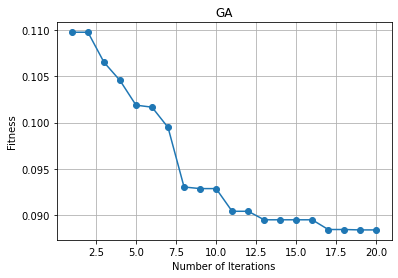

# Detecting and Preventing Spam Messages

 This project was part of my undergraduate research experience, and I wrote a paper in which I analyzed the results in more detail. Please feel free to read the [research paper](https://github.com/Raed-Alshehri/ProjectsPortfolio/blob/main/Detecting%20and%20Preventing%20Spam%20Messages/Detecting%20and%20Preventing%20Cyber%20Threats%20Using%20Machine%20Learning%20Techniques.pdf)

 I used Particle Swarm Algorithm and Genetic Algorithm to optimize the process of predicting spam messages using machine learning. 
 
 The dataset was obtained from a public repository: https://archive.ics.uci.edu/ml/machine-learning-databases/spambase/spambase.data

## Code
```python
# libraries:
# General
import matplotlib.pyplot as plt
import numpy as np
import pandas as pd

# Preprocessing, metric, etc...
from sklearn.model_selection import train_test_split
from sklearn.preprocessing import StandardScaler
from sklearn.metrics import accuracy_score, confusion_matrix

# Existing methods
from sklearn.ensemble import RandomForestClassifier 
from sklearn import tree
from sklearn.naive_bayes import GaussianNB
from sklearn import svm
from sklearn.neighbors import KNeighborsClassifier
from sklearn.model_selection import GridSearchCV
from sklearn.model_selection import cross_val_score,StratifiedKFold
```


```python
df = pd.read_csv('https://archive.ics.uci.edu/ml/machine-learning-databases/spambase/spambase.data', header=None,
                 prefix='Column_')
display(df.sample(5))
#display(df.info())
df
```


<table border="1" class="dataframe">
  <thead>
    <tr style="text-align: right;">
      <th></th>
      <th>Column_0</th>
      <th>Column_1</th>
      <th>Column_2</th>
      <th>Column_3</th>
      <th>Column_4</th>
      <th>Column_5</th>
      <th>Column_6</th>
      <th>Column_7</th>
      <th>Column_8</th>
      <th>Column_9</th>
      <th>...</th>
      <th>Column_48</th>
      <th>Column_49</th>
      <th>Column_50</th>
      <th>Column_51</th>
      <th>Column_52</th>
      <th>Column_53</th>
      <th>Column_54</th>
      <th>Column_55</th>
      <th>Column_56</th>
      <th>Column_57</th>
    </tr>
  </thead>
  <tbody>
    <tr>
      <th>1286</th>
      <td>0.0</td>
      <td>0.39</td>
      <td>0.99</td>
      <td>0.0</td>
      <td>0.39</td>
      <td>0.0</td>
      <td>0.19</td>
      <td>0.00</td>
      <td>0.19</td>
      <td>0.19</td>
      <td>...</td>
      <td>0.0</td>
      <td>0.074</td>
      <td>0.0</td>
      <td>0.174</td>
      <td>0.548</td>
      <td>0.000</td>
      <td>4.965</td>
      <td>97</td>
      <td>993</td>
      <td>1</td>
    </tr>
    <tr>
      <th>1825</th>
      <td>0.0</td>
      <td>0.00</td>
      <td>0.00</td>
      <td>0.0</td>
      <td>0.00</td>
      <td>0.0</td>
      <td>0.00</td>
      <td>0.00</td>
      <td>0.00</td>
      <td>0.00</td>
      <td>...</td>
      <td>0.0</td>
      <td>0.308</td>
      <td>0.0</td>
      <td>0.000</td>
      <td>0.000</td>
      <td>0.000</td>
      <td>2.000</td>
      <td>11</td>
      <td>26</td>
      <td>0</td>
    </tr>
    <tr>
      <th>624</th>
      <td>0.0</td>
      <td>0.00</td>
      <td>0.00</td>
      <td>0.0</td>
      <td>0.82</td>
      <td>0.0</td>
      <td>0.00</td>
      <td>1.65</td>
      <td>0.00</td>
      <td>0.82</td>
      <td>...</td>
      <td>0.0</td>
      <td>0.113</td>
      <td>0.0</td>
      <td>0.113</td>
      <td>0.000</td>
      <td>0.000</td>
      <td>1.250</td>
      <td>4</td>
      <td>50</td>
      <td>1</td>
    </tr>
    <tr>
      <th>1417</th>
      <td>0.1</td>
      <td>0.20</td>
      <td>1.01</td>
      <td>0.0</td>
      <td>0.80</td>
      <td>0.8</td>
      <td>0.50</td>
      <td>0.00</td>
      <td>0.80</td>
      <td>0.10</td>
      <td>...</td>
      <td>0.0</td>
      <td>0.110</td>
      <td>0.0</td>
      <td>0.488</td>
      <td>0.157</td>
      <td>0.015</td>
      <td>8.550</td>
      <td>669</td>
      <td>1351</td>
      <td>1</td>
    </tr>
    <tr>
      <th>2240</th>
      <td>0.0</td>
      <td>0.00</td>
      <td>0.00</td>
      <td>0.0</td>
      <td>0.00</td>
      <td>0.0</td>
      <td>0.00</td>
      <td>0.00</td>
      <td>0.00</td>
      <td>0.00</td>
      <td>...</td>
      <td>0.0</td>
      <td>0.337</td>
      <td>0.0</td>
      <td>0.000</td>
      <td>0.000</td>
      <td>0.337</td>
      <td>2.950</td>
      <td>7</td>
      <td>59</td>
      <td>0</td>
    </tr>
  </tbody>
</table>
<p>5 rows × 58 columns</p>
</div>


<table border="1" class="dataframe">
  <thead>
    <tr style="text-align: right;">
      <th></th>
      <th>Column_0</th>
      <th>Column_1</th>
      <th>Column_2</th>
      <th>Column_3</th>
      <th>Column_4</th>
      <th>Column_5</th>
      <th>Column_6</th>
      <th>Column_7</th>
      <th>Column_8</th>
      <th>Column_9</th>
      <th>...</th>
      <th>Column_48</th>
      <th>Column_49</th>
      <th>Column_50</th>
      <th>Column_51</th>
      <th>Column_52</th>
      <th>Column_53</th>
      <th>Column_54</th>
      <th>Column_55</th>
      <th>Column_56</th>
      <th>Column_57</th>
    </tr>
  </thead>
  <tbody>
    <tr>
      <th>0</th>
      <td>0.00</td>
      <td>0.64</td>
      <td>0.64</td>
      <td>0.0</td>
      <td>0.32</td>
      <td>0.00</td>
      <td>0.00</td>
      <td>0.00</td>
      <td>0.00</td>
      <td>0.00</td>
      <td>...</td>
      <td>0.000</td>
      <td>0.000</td>
      <td>0.0</td>
      <td>0.778</td>
      <td>0.000</td>
      <td>0.000</td>
      <td>3.756</td>
      <td>61</td>
      <td>278</td>
      <td>1</td>
    </tr>
    <tr>
      <th>1</th>
      <td>0.21</td>
      <td>0.28</td>
      <td>0.50</td>
      <td>0.0</td>
      <td>0.14</td>
      <td>0.28</td>
      <td>0.21</td>
      <td>0.07</td>
      <td>0.00</td>
      <td>0.94</td>
      <td>...</td>
      <td>0.000</td>
      <td>0.132</td>
      <td>0.0</td>
      <td>0.372</td>
      <td>0.180</td>
      <td>0.048</td>
      <td>5.114</td>
      <td>101</td>
      <td>1028</td>
      <td>1</td>
    </tr>
    <tr>
      <th>2</th>
      <td>0.06</td>
      <td>0.00</td>
      <td>0.71</td>
      <td>0.0</td>
      <td>1.23</td>
      <td>0.19</td>
      <td>0.19</td>
      <td>0.12</td>
      <td>0.64</td>
      <td>0.25</td>
      <td>...</td>
      <td>0.010</td>
      <td>0.143</td>
      <td>0.0</td>
      <td>0.276</td>
      <td>0.184</td>
      <td>0.010</td>
      <td>9.821</td>
      <td>485</td>
      <td>2259</td>
      <td>1</td>
    </tr>
    <tr>
      <th>3</th>
      <td>0.00</td>
      <td>0.00</td>
      <td>0.00</td>
      <td>0.0</td>
      <td>0.63</td>
      <td>0.00</td>
      <td>0.31</td>
      <td>0.63</td>
      <td>0.31</td>
      <td>0.63</td>
      <td>...</td>
      <td>0.000</td>
      <td>0.137</td>
      <td>0.0</td>
      <td>0.137</td>
      <td>0.000</td>
      <td>0.000</td>
      <td>3.537</td>
      <td>40</td>
      <td>191</td>
      <td>1</td>
    </tr>
    <tr>
      <th>4</th>
      <td>0.00</td>
      <td>0.00</td>
      <td>0.00</td>
      <td>0.0</td>
      <td>0.63</td>
      <td>0.00</td>
      <td>0.31</td>
      <td>0.63</td>
      <td>0.31</td>
      <td>0.63</td>
      <td>...</td>
      <td>0.000</td>
      <td>0.135</td>
      <td>0.0</td>
      <td>0.135</td>
      <td>0.000</td>
      <td>0.000</td>
      <td>3.537</td>
      <td>40</td>
      <td>191</td>
      <td>1</td>
    </tr>
    <tr>
      <th>...</th>
      <td>...</td>
      <td>...</td>
      <td>...</td>
      <td>...</td>
      <td>...</td>
      <td>...</td>
      <td>...</td>
      <td>...</td>
      <td>...</td>
      <td>...</td>
      <td>...</td>
      <td>...</td>
      <td>...</td>
      <td>...</td>
      <td>...</td>
      <td>...</td>
      <td>...</td>
      <td>...</td>
      <td>...</td>
      <td>...</td>
      <td>...</td>
    </tr>
    <tr>
      <th>4596</th>
      <td>0.31</td>
      <td>0.00</td>
      <td>0.62</td>
      <td>0.0</td>
      <td>0.00</td>
      <td>0.31</td>
      <td>0.00</td>
      <td>0.00</td>
      <td>0.00</td>
      <td>0.00</td>
      <td>...</td>
      <td>0.000</td>
      <td>0.232</td>
      <td>0.0</td>
      <td>0.000</td>
      <td>0.000</td>
      <td>0.000</td>
      <td>1.142</td>
      <td>3</td>
      <td>88</td>
      <td>0</td>
    </tr>
    <tr>
      <th>4597</th>
      <td>0.00</td>
      <td>0.00</td>
      <td>0.00</td>
      <td>0.0</td>
      <td>0.00</td>
      <td>0.00</td>
      <td>0.00</td>
      <td>0.00</td>
      <td>0.00</td>
      <td>0.00</td>
      <td>...</td>
      <td>0.000</td>
      <td>0.000</td>
      <td>0.0</td>
      <td>0.353</td>
      <td>0.000</td>
      <td>0.000</td>
      <td>1.555</td>
      <td>4</td>
      <td>14</td>
      <td>0</td>
    </tr>
    <tr>
      <th>4598</th>
      <td>0.30</td>
      <td>0.00</td>
      <td>0.30</td>
      <td>0.0</td>
      <td>0.00</td>
      <td>0.00</td>
      <td>0.00</td>
      <td>0.00</td>
      <td>0.00</td>
      <td>0.00</td>
      <td>...</td>
      <td>0.102</td>
      <td>0.718</td>
      <td>0.0</td>
      <td>0.000</td>
      <td>0.000</td>
      <td>0.000</td>
      <td>1.404</td>
      <td>6</td>
      <td>118</td>
      <td>0</td>
    </tr>
    <tr>
      <th>4599</th>
      <td>0.96</td>
      <td>0.00</td>
      <td>0.00</td>
      <td>0.0</td>
      <td>0.32</td>
      <td>0.00</td>
      <td>0.00</td>
      <td>0.00</td>
      <td>0.00</td>
      <td>0.00</td>
      <td>...</td>
      <td>0.000</td>
      <td>0.057</td>
      <td>0.0</td>
      <td>0.000</td>
      <td>0.000</td>
      <td>0.000</td>
      <td>1.147</td>
      <td>5</td>
      <td>78</td>
      <td>0</td>
    </tr>
    <tr>
      <th>4600</th>
      <td>0.00</td>
      <td>0.00</td>
      <td>0.65</td>
      <td>0.0</td>
      <td>0.00</td>
      <td>0.00</td>
      <td>0.00</td>
      <td>0.00</td>
      <td>0.00</td>
      <td>0.00</td>
      <td>...</td>
      <td>0.000</td>
      <td>0.000</td>
      <td>0.0</td>
      <td>0.125</td>
      <td>0.000</td>
      <td>0.000</td>
      <td>1.250</td>
      <td>5</td>
      <td>40</td>
      <td>0</td>
    </tr>
  </tbody>
</table>
<p>4601 rows × 58 columns</p>
</div>


```python
# Generate Train - Test splits
x_set = df.iloc[:,:-1].values
y_set = df.iloc[:,-1].values
xtrain, xtest, ytrain, ytest = train_test_split(x_set, y_set, test_size=0.3, random_state=10)
```


```python
# Scaling the Train - Test splits
scaler = StandardScaler()
scaler.fit(xtrain)
xtrain = scaler.transform(xtrain)
xtest = scaler.transform(xtest)
```

# Calculating accuracy (k-fold cross-validation)


```python
# file: functionHO (accuracy calculation)

def error_rate(xtrain, ytrain, x, opts, model):
    # parameters
    k     = opts['k']
    fold  = opts['fold']
    xt    = fold['xt']
    yt    = fold['yt']
    
    
    # Number of instances
    num_train = np.size(xt, 0)

    # Define selected features
    xtrain  = xt[:, x == 1]
    ytrain  = yt.reshape(num_train)  # Solve bug
    
    # Training
    mdl     = model
    # mdl.fit(xtrain, ytrain)

    # Cross Validation
    stratifiedkf=StratifiedKFold(n_splits=5)
    score=cross_val_score(mdl, xtrain, ytrain, cv=stratifiedkf)
    # print("Cross Validation Scores are {}".format(score))
    # print("Average Cross Validation score :{}".format(score.mean()))
    
    error = 1 - score.mean()
    return error


# Error rate & Feature size
def Fun(xtrain, ytrain, x, opts, model):
    # Parameters
    alpha    = 0.99
    beta     = 1 - alpha
    # Original feature size
    max_feat = len(x)
    # Number of selected features
    num_feat = np.sum(x == 1)
    # Solve if no feature selected
    if num_feat == 0:
        cost  = 1
    else:
        # Get error rate
        error = error_rate(xtrain, ytrain, x, opts, model)
        # Objective function
        cost  = alpha * error + beta * (num_feat / max_feat)
        
    return cost
```

# Genetic Algorithm for Feature Selection:


```python
# Genetic Algorithm for Feature Selection:

import numpy as np
from numpy.random import rand

def init_position(lb, ub, N, dim):
    X = np.zeros([N, dim], dtype='float')
    for i in range(N):
        for d in range(dim):
            X[i,d] = lb[0,d] + (ub[0,d] - lb[0,d]) * rand()        
    return X

def binary_conversion(X, thres, N, dim):
    Xbin = np.zeros([N, dim], dtype='int')
    for i in range(N):
        for d in range(dim):
            if X[i,d] > thres:
                Xbin[i,d] = 1
            else:
                Xbin[i,d] = 0
    return Xbin

def roulette_wheel(prob):
    num = len(prob)
    C   = np.cumsum(prob)
    P   = rand()
    for i in range(num):
        if C[i] > P:
            index = i;
            break
    return index

def jfsGA(xtrain, ytrain, opts, model):
    # Parameters
    ub       = 1
    lb       = 0
    thres    = 0.5    
    CR       = 0.8     # crossover rate
    MR       = 0.01    # mutation rate

    N        = opts['N']
    max_iter = opts['T']
    if 'CR' in opts:
        CR   = opts['CR'] 
    if 'MR' in opts: 
        MR   = opts['MR']  
     # Dimension
    dim = np.size(xtrain, 1)
    if np.size(lb) == 1:
        ub = ub * np.ones([1, dim], dtype='float')
        lb = lb * np.ones([1, dim], dtype='float')
    # Initialize position 
    X     = init_position(lb, ub, N, dim)
    # Binary conversion
    X     = binary_conversion(X, thres, N, dim)
    # Fitness at first iteration
    fit   = np.zeros([N, 1], dtype='float')
    Xgb   = np.zeros([1, dim], dtype='int')
    fitG  = float('inf')
    for i in range(N):
        fit[i,0] = Fun(xtrain, ytrain, X[i,:], opts, model)
        if fit[i,0] < fitG:
            Xgb[0,:] = X[i,:]
            fitG     = fit[i,0]
    # Pre
    curve = np.zeros([1, max_iter], dtype='float')
    t     = 0
    
    curve[0,t] = fitG.copy()
    print("Generation:", t + 1)
    print("Best (GA):", curve[0,t])
    t += 1
    while t < max_iter:
        # Probability
        inv_fit = 1 / (1 + fit)
        prob    = inv_fit / np.sum(inv_fit) 
        # Number of crossovers
        Nc = 0
        for i in range(N):
            if rand() < CR:
              Nc += 1
        x1 = np.zeros([Nc, dim], dtype='int')
        x2 = np.zeros([Nc, dim], dtype='int')
        for i in range(Nc):
            # Parent selection
            k1      = roulette_wheel(prob)
            k2      = roulette_wheel(prob)
            P1      = X[k1,:].copy()
            P2      = X[k2,:].copy()
            # Random one dimension from 1 to dim
            index   = np.random.randint(low = 1, high = dim-1)
            # Crossover
            x1[i,:] = np.concatenate((P1[0:index] , P2[index:]))
            x2[i,:] = np.concatenate((P2[0:index] , P1[index:]))
            # Mutation
            for d in range(dim):
                if rand() < MR:
                    x1[i,d] = 1 - x1[i,d]
                    
                if rand() < MR:
                    x2[i,d] = 1 - x2[i,d]
        # Merge two group into one
        Xnew = np.concatenate((x1 , x2), axis=0)
        # Fitness
        Fnew = np.zeros([2 * Nc, 1], dtype='float')
        for i in range(2 * Nc):
            Fnew[i,0] = Fun(xtrain, ytrain, Xnew[i,:], opts, model)
            if Fnew[i,0] < fitG:
                Xgb[0,:] = Xnew[i,:]
                fitG     = Fnew[i,0]       
        # Store result
        curve[0,t] = fitG.copy()
        print("Generation:", t + 1)
        print("Best (GA):", curve[0,t])
        t += 1
        # Elitism 
        XX  = np.concatenate((X , Xnew), axis=0)
        FF  = np.concatenate((fit , Fnew), axis=0)
        # Sort in ascending order
        ind = np.argsort(FF, axis=0)
        for i in range(N):
            X[i,:]   = XX[ind[i,0],:]
            fit[i,0] = FF[ind[i,0]]         
    # Best feature subset
    Gbin       = Xgb[0,:]
    Gbin       = Gbin.reshape(dim)
    pos        = np.asarray(range(0, dim))    
    sel_index  = pos[Gbin == 1]
    num_feat   = len(sel_index)
    # Create dictionary
    ga_data = {'sf': sel_index, 'c': curve, 'nf': num_feat}
    return ga_data 
```

# Particle Swarm Optimization for Feature Selection:


```python
# Particle Swarm Optimization for Feature Selection:

def init_position(lb, ub, N, dim):
    X = np.zeros([N, dim], dtype='float')
    for i in range(N):
        for d in range(dim):
            X[i,d] = lb[0,d] + (ub[0,d] - lb[0,d]) * rand()        
    return X

def init_velocity(lb, ub, N, dim):
    V    = np.zeros([N, dim], dtype='float')
    Vmax = np.zeros([1, dim], dtype='float')
    Vmin = np.zeros([1, dim], dtype='float')
    # Maximum & minimum velocity
    for d in range(dim):
        Vmax[0,d] = (ub[0,d] - lb[0,d]) / 2
        Vmin[0,d] = -Vmax[0,d]
    for i in range(N):
        for d in range(dim):
            V[i,d] = Vmin[0,d] + (Vmax[0,d] - Vmin[0,d]) * rand()
    return V, Vmax, Vmin

def binary_conversion(X, thres, N, dim):
    Xbin = np.zeros([N, dim], dtype='int')
    for i in range(N):
        for d in range(dim):
            if X[i,d] > thres:
                Xbin[i,d] = 1
            else:
                Xbin[i,d] = 0 
    return Xbin

def boundary(x, lb, ub):
    if x < lb:
        x = lb
    if x > ub:
        x = ub
    return x
    
def jfsPSO(xtrain, ytrain, opts, model):
    # Parameters
    ub    = 1
    lb    = 0
    thres = 0.5
    w     = 0.9    # inertia weight
    c1    = 2      # acceleration factor
    c2    = 2      # acceleration factor

    N        = opts['N']
    max_iter = opts['T']
    if 'w' in opts:
        w    = opts['w']
    if 'c1' in opts:
        c1   = opts['c1']
    if 'c2' in opts:
        c2   = opts['c2'] 
    # Dimension
    dim = np.size(xtrain, 1) # number of columns (Features)
    if np.size(lb) == 1:
        ub = ub * np.ones([1, dim], dtype='float')
        lb = lb * np.ones([1, dim], dtype='float')
    # Initialize position & velocity
    X             = init_position(lb, ub, N, dim)
    V, Vmax, Vmin = init_velocity(lb, ub, N, dim) 
    # Pre
    fit   = np.zeros([N, 1], dtype='float')
    Xgb   = np.zeros([1, dim], dtype='float')
    fitG  = float('inf')
    Xpb   = np.zeros([N, dim], dtype='float')
    fitP  = float('inf') * np.ones([N, 1], dtype='float')
    curve = np.zeros([1, max_iter], dtype='float') 
    t     = 0
    while t < max_iter:
        # Binary conversion
        Xbin = binary_conversion(X, thres, N, dim)
        # Fitness
        for i in range(N):
            fit[i,0] = Fun(xtrain, ytrain, Xbin[i,:], opts, model)
            if fit[i,0] < fitP[i,0]:
                Xpb[i,:]  = X[i,:]
                fitP[i,0] = fit[i,0]
            if fitP[i,0] < fitG:
                Xgb[0,:]  = Xpb[i,:]
                fitG      = fitP[i,0]
        # Store result
        curve[0,t] = fitG.copy()
        print("Iteration:", t + 1)
        print("Best (PSO):", curve[0,t])
        t += 1
        for i in range(N):
            for d in range(dim):
                # Update velocity
                r1     = rand()
                r2     = rand()
                V[i,d] = w * V[i,d] + c1 * r1 * (Xpb[i,d] - X[i,d]) + c2 * r2 * (Xgb[0,d] - X[i,d]) 
                # Boundary
                V[i,d] = boundary(V[i,d], Vmin[0,d], Vmax[0,d])
                # Update position
                X[i,d] = X[i,d] + V[i,d]
                # Boundary
                X[i,d] = boundary(X[i,d], lb[0,d], ub[0,d])     
    # Best feature subset
    Gbin       = binary_conversion(Xgb, thres, 1, dim) 
    Gbin       = Gbin.reshape(dim)
    pos        = np.asarray(range(0, dim))    
    sel_index  = pos[Gbin == 1]
    num_feat   = len(sel_index)
    # Create dictionary
    pso_data = {'sf': sel_index, 'c': curve, 'nf': num_feat}
    return pso_data    
```

# GA_implementation


```python
# file: GA_implementation

def GA_implementation(model):
    fold = {'xt':xtrain, 'yt':ytrain, 'xv':xtest, 'yv':ytest}
    mdl       = model
    mdl.fit(xtrain, ytrain)

    # accuracy
    y_pred    = mdl.predict(xtest)
    print("Accuracy:", accuracy_score(ytest, y_pred))

    # parameter
    k    = 3     # k-value in KNN
    N    = 10    # number of chromosomes
    T    = 20    # maximum number of generations
    CR   = 0.8
    MR   = 0.01
    opts = {'k':k, 'fold':fold, 'N':N, 'T':T, 'CR':CR, 'MR':MR}

    # perform feature selection
    fmdl = jfsGA(x_set, y_set, opts, model)
    sf   = fmdl['sf']

    # model with selected features
    num_train = np.size(xtrain, 0)
    num_valid = np.size(xtest, 0)
    x_train   = xtrain[:, sf]
    y_train   = ytrain.reshape(num_train)  # Solve bug
    x_valid   = xtest[:, sf]
    y_valid   = ytest.reshape(num_valid)  # Solve bug

    mdl       = model
    mdl.fit(x_train, y_train)

    # accuracy
    y_pred    = mdl.predict(x_valid)
    print("Accuracy:", accuracy_score(y_valid, y_pred))
    print("Confusion Matrix:= \n", confusion_matrix(y_valid, y_pred) )

    # number of selected features
    num_feat = fmdl['nf']
    print("Feature Size:", num_feat)
    features_indexes = fmdl["sf"];
    print("Features Indexes:", fmdl["sf"])
    # selected_features = [y_set[i] for i in fmdl["sf"]]
    # print("Selected Features:", selected_features)

    # plot convergence
    curve   = fmdl['c']
    curve   = curve.reshape(np.size(curve,1))
    x       = np.arange(0, opts['T'], 1.0) + 1.0

    fig, ax = plt.subplots()
    ax.plot(x, curve, 'o-')
    ax.set_xlabel('Number of Iterations')
    ax.set_ylabel('Fitness')
    ax.set_title('GA')
    ax.grid()
    plt.show()
```

# PSO_implementation


```python
# file: PSO_implementation (KNN)

def PSO_implementation(model):
    fold = {'xt':xtrain, 'yt':ytrain, 'xv':xtest, 'yv':ytest}
    mdl       = model
    mdl.fit(xtrain, ytrain)

    # accuracy
    y_pred    = mdl.predict(xtest)
    print("Accuracy:", accuracy_score(ytest, y_pred))

    # parameter
    k    = 5     # k-value in KNN
    N    = 10    # number of particles
    T    = 20   # maximum number of iterations
    w    = 0.9
    c1   = 2
    c2   = 2
    opts = {'k':k, 'fold':fold, 'N':N, 'T':T, 'w':w, 'c1':c1, 'c2':c2}

    # perform feature selection
    fmdl = jfsPSO(x_set, y_set, opts, model)
    sf = fmdl['sf']

    # model with selected features
    num_train = np.size(xtrain, 0)
    num_valid = np.size(xtest, 0)
    x_train   = xtrain[:, sf]
    y_train   = ytrain.reshape(num_train)  # Solve bug
    x_valid   = xtest[:, sf]
    y_valid   = ytest.reshape(num_valid)  # Solve bug

    mdl       = model
    mdl.fit(x_train, y_train)

    # accuracy
    y_pred    = mdl.predict(x_valid)
    print("Accuracy:", accuracy_score(y_valid, y_pred))

    # number of selected features
    num_feat = fmdl['nf']
    print("Feature Size:", num_feat)
    features_indexes = fmdl["sf"];
    print("Features Indexes:", fmdl["sf"])
    # selected_features = [y_set[i] for i in fmdl["sf"]]
    # print("Selected Features:", selected_features)

    # plot convergence
    curve   = fmdl['c']
    curve   = curve.reshape(np.size(curve,1))
    x       = np.arange(0, opts['T'], 1.0) + 1.0

    fig, ax = plt.subplots()
    ax.plot(x, curve, 'o-')
    ax.set_xlabel('Number of Iterations')
    ax.set_ylabel('Fitness')
    ax.set_title('PSO')
    ax.grid()
    plt.show()
```

# Decision Tree Classifier


```python
# Train
dtClf = tree.DecisionTreeClassifier(random_state=0,criterion='entropy',splitter='best')
PSO_implementation(dtClf)
GA_implementation(dtClf)
```

    Accuracy: 0.9174511223750905
    Iteration: 1
    Best (PSO): 0.09438122480113334
    Iteration: 2
    Best (PSO): 0.09380974174566852
    Iteration: 3
    Best (PSO): 0.09073520758417788
    Iteration: 4
    Best (PSO): 0.08643085975809084
    Iteration: 5
    Best (PSO): 0.08612340634194182
    Iteration: 6
    Best (PSO): 0.0799309142421269
    Iteration: 7
    Best (PSO): 0.0799309142421269
    Iteration: 8
    Best (PSO): 0.0799309142421269
    Iteration: 9
    Best (PSO): 0.0799309142421269
    Iteration: 10
    Best (PSO): 0.0799309142421269
    Iteration: 11
    Best (PSO): 0.07764672550942585
    Iteration: 12
    Best (PSO): 0.07764672550942585
    Iteration: 13
    Best (PSO): 0.07764672550942585
    Iteration: 14
    Best (PSO): 0.07764672550942585
    Iteration: 15
    Best (PSO): 0.07720725727361893
    Iteration: 16
    Best (PSO): 0.07720725727361893
    Iteration: 17
    Best (PSO): 0.07720725727361893
    Iteration: 18
    Best (PSO): 0.07637348806799613
    Iteration: 19
    Best (PSO): 0.07637348806799613
    Iteration: 20
    Best (PSO): 0.07637348806799613
    Accuracy: 0.9312092686459088
    Feature Size: 27
    Features Indexes: [ 6  9 10 11 13 14 15 16 20 22 23 24 25 26 33 34 35 38 40 41 44 45 47 48
     52 55 56]
    


    

    


    Accuracy: 0.9174511223750905
    Generation: 1
    Best (GA): 0.1007925792742726
    Generation: 2
    Best (GA): 0.09877242018088704
    Generation: 3
    Best (GA): 0.09877242018088704
    Generation: 4
    Best (GA): 0.09780663615560642
    Generation: 5
    Best (GA): 0.09780663615560642
    Generation: 6
    Best (GA): 0.09688427590715915
    Generation: 7
    Best (GA): 0.0956978860193964
    Generation: 8
    Best (GA): 0.09249133703824786
    Generation: 9
    Best (GA): 0.09047117794486219
    Generation: 10
    Best (GA): 0.09047117794486219
    Generation: 11
    Best (GA): 0.09025231557153762
    Generation: 12
    Best (GA): 0.0898128473357306
    Generation: 13
    Best (GA): 0.0850256074970033
    Generation: 14
    Best (GA): 0.08427868584504748
    Generation: 15
    Best (GA): 0.08427868584504748
    Generation: 16
    Best (GA): 0.08427868584504748
    Generation: 17
    Best (GA): 0.08427868584504748
    Generation: 18
    Best (GA): 0.08427868584504748
    Generation: 19
    Best (GA): 0.08427868584504748
    Generation: 20
    Best (GA): 0.08427868584504748
    Accuracy: 0.9283128167994207
    Confusion Matrix:= 
     [[777  44]
     [ 55 505]]
    Feature Size: 30
    Features Indexes: [ 1  2  3  6  7  9 10 12 15 21 23 24 25 26 28 29 31 32 33 35 36 43 44 45
     47 50 51 52 53 55]
    


    

    


## Random Forest Classifier


```python
rfClf = RandomForestClassifier(random_state=0)
PSO_implementation(rfClf)
GA_implementation(rfClf)
```

    Accuracy: 0.9572773352643013
    Iteration: 1
    Best (PSO): 0.060427590715920215
    Iteration: 2
    Best (PSO): 0.060427590715920215
    Iteration: 3
    Best (PSO): 0.06034074316225344
    Iteration: 4
    Best (PSO): 0.060208728342595545
    Iteration: 5
    Best (PSO): 0.060208728342595545
    Iteration: 6
    Best (PSO): 0.060208728342595545
    Iteration: 7
    Best (PSO): 0.060208728342595545
    Iteration: 8
    Best (PSO): 0.05660613490247353
    Iteration: 9
    Best (PSO): 0.05660613490247353
    Iteration: 10
    Best (PSO): 0.05660613490247353
    Iteration: 11
    Best (PSO): 0.05660613490247353
    Iteration: 12
    Best (PSO): 0.05660613490247353
    Iteration: 13
    Best (PSO): 0.05660613490247353
    Iteration: 14
    Best (PSO): 0.05660613490247353
    Iteration: 15
    Best (PSO): 0.05660613490247353
    Iteration: 16
    Best (PSO): 0.05660613490247353
    Iteration: 17
    Best (PSO): 0.05660613490247353
    Iteration: 18
    Best (PSO): 0.05660613490247353
    Iteration: 19
    Best (PSO): 0.05660613490247353
    Iteration: 20
    Best (PSO): 0.05660613490247353
    Accuracy: 0.9514844315713251
    Feature Size: 37
    Features Indexes: [ 2  4  5  6  7  8  9 11 14 15 16 18 19 20 21 23 24 26 27 28 29 31 32 33
     35 37 39 40 41 43 44 45 49 51 53 54 55]
    


    

    


    Accuracy: 0.9572773352643013
    Generation: 1
    Best (GA): 0.05963724528713094
    Generation: 2
    Best (GA): 0.05963724528713094
    Generation: 3
    Best (GA): 0.05963724528713094
    Generation: 4
    Best (GA): 0.05963724528713094
    Generation: 5
    Best (GA): 0.05963724528713094
    Generation: 6
    Best (GA): 0.05963724528713094
    Generation: 7
    Best (GA): 0.05963724528713094
    Generation: 8
    Best (GA): 0.05963724528713094
    Generation: 9
    Best (GA): 0.05963724528713094
    Generation: 10
    Best (GA): 0.05963724528713094
    Generation: 11
    Best (GA): 0.05963724528713094
    Generation: 12
    Best (GA): 0.05963724528713094
    Generation: 13
    Best (GA): 0.05963724528713094
    Generation: 14
    Best (GA): 0.05963724528713094
    Generation: 15
    Best (GA): 0.05963724528713094
    Generation: 16
    Best (GA): 0.05963724528713094
    Generation: 17
    Best (GA): 0.05963724528713094
    Generation: 18
    Best (GA): 0.05963724528713094
    Generation: 19
    Best (GA): 0.05963724528713094
    Generation: 20
    Best (GA): 0.05963724528713094
    Accuracy: 0.9377262853005068
    Confusion Matrix:= 
     [[789  32]
     [ 54 506]]
    Feature Size: 35
    Features Indexes: [ 1  2  3  4  5  8  9 10 12 13 15 16 17 19 20 22 24 26 28 29 30 32 33 35
     36 37 38 40 45 47 49 51 54 55 56]
    


    

    


# Naive Bayes


```python
NBClf = GaussianNB()   
PSO_implementation(NBClf)
GA_implementation(NBClf)
```

    Accuracy: 0.8211440984793628
    Iteration: 1
    Best (PSO): 0.22794802222948665
    Iteration: 2
    Best (PSO): 0.22311561512476835
    Iteration: 3
    Best (PSO): 0.21235474555955114
    Iteration: 4
    Best (PSO): 0.21235474555955114
    Iteration: 5
    Best (PSO): 0.20809382151029743
    Iteration: 6
    Best (PSO): 0.20809382151029743
    Iteration: 7
    Best (PSO): 0.20668856924921
    Iteration: 8
    Best (PSO): 0.2018579056336494
    Iteration: 9
    Best (PSO): 0.2014184373978425
    Iteration: 10
    Best (PSO): 0.20005660891358826
    Iteration: 11
    Best (PSO): 0.19851934183284306
    Iteration: 12
    Best (PSO): 0.19851934183284306
    Iteration: 13
    Best (PSO): 0.19851934183284306
    Iteration: 14
    Best (PSO): 0.19851934183284306
    Iteration: 15
    Best (PSO): 0.19851934183284306
    Iteration: 16
    Best (PSO): 0.19807987359703613
    Iteration: 17
    Best (PSO): 0.19794785877737825
    Iteration: 18
    Best (PSO): 0.197772420180887
    Iteration: 19
    Best (PSO): 0.197772420180887
    Iteration: 20
    Best (PSO): 0.197772420180887
    Accuracy: 0.8305575669804489
    Feature Size: 32
    Features Indexes: [ 0  1  3  5  6  9 10 12 13 15 16 17 18 19 20 22 23 24 26 28 32 39 41 42
     43 44 45 47 52 53 55 56]
    


    

    


    Accuracy: 0.8211440984793628
    Generation: 1
    Best (GA): 0.23009845265337264
    Generation: 2
    Best (GA): 0.23009845265337264
    Generation: 3
    Best (GA): 0.2154727034978751
    Generation: 4
    Best (GA): 0.2154727034978751
    Generation: 5
    Best (GA): 0.21437490465293668
    Generation: 6
    Best (GA): 0.20717146126185038
    Generation: 7
    Best (GA): 0.20659997820638554
    Generation: 8
    Best (GA): 0.2039649122807017
    Generation: 9
    Best (GA): 0.2039649122807017
    Generation: 10
    Best (GA): 0.2039649122807017
    Generation: 11
    Best (GA): 0.20181273836765837
    Generation: 12
    Best (GA): 0.19764040536122923
    Generation: 13
    Best (GA): 0.19764040536122923
    Generation: 14
    Best (GA): 0.19764040536122923
    Generation: 15
    Best (GA): 0.19276457447967738
    Generation: 16
    Best (GA): 0.19276457447967738
    Generation: 17
    Best (GA): 0.19276457447967738
    Generation: 18
    Best (GA): 0.17734847989539054
    Generation: 19
    Best (GA): 0.17734847989539054
    Generation: 20
    Best (GA): 0.1532350986161055
    Accuracy: 0.8501086169442433
    Confusion Matrix:= 
     [[639 182]
     [ 25 535]]
    Feature Size: 34
    Features Indexes: [ 0  1  2  3  4  5  6 10 11 12 14 15 16 17 19 20 21 23 24 25 26 27 34 36
     39 41 44 45 50 52 53 54 55 56]
    


    

    


# Support Vector Machines -- *Linear*


```python
#SVM Model
clf = svm.SVC(kernel='linear') 
PSO_implementation(clf)
GA_implementation(clf)
```

    Accuracy: 0.9355539464156408
    Iteration: 1
    Best (PSO): 0.0959601721695544
    Iteration: 2
    Best (PSO): 0.0959601721695544
    Iteration: 3
    Best (PSO): 0.0959601721695544
    Iteration: 4
    Best (PSO): 0.09288563800806376
    Iteration: 5
    Best (PSO): 0.09288563800806376
    Iteration: 6
    Best (PSO): 0.09288563800806376
    Iteration: 7
    Best (PSO): 0.09288563800806376
    Iteration: 8
    Best (PSO): 0.0926650321455814
    Iteration: 9
    Best (PSO): 0.0926650321455814
    Iteration: 10
    Best (PSO): 0.09148038574697623
    Iteration: 11
    Best (PSO): 0.08932821183393255
    Iteration: 12
    Best (PSO): 0.0877475209763539
    Iteration: 13
    Best (PSO): 0.08445238095238089
    Iteration: 14
    Best (PSO): 0.08423351857905635
    Iteration: 15
    Best (PSO): 0.08410150375939844
    Iteration: 16
    Best (PSO): 0.08282826631796882
    Iteration: 17
    Best (PSO): 0.08269625149831092
    Iteration: 18
    Best (PSO): 0.08225678326250423
    Iteration: 19
    Best (PSO): 0.0814230140568814
    Iteration: 20
    Best (PSO): 0.0814230140568814
    Accuracy: 0.9268645908761767
    Feature Size: 33
    Features Indexes: [ 0  1  3  4  5  6 10 11 12 15 16 18 20 22 23 24 26 28 30 32 34 35 36 38
     39 43 44 45 47 51 52 55 56]
    


    

    


    Accuracy: 0.9355539464156408
    Generation: 1
    Best (GA): 0.10206581671570222
    Generation: 2
    Best (GA): 0.0964013838945189
    Generation: 3
    Best (GA): 0.0964013838945189
    Generation: 4
    Best (GA): 0.0964013838945189
    Generation: 5
    Best (GA): 0.0964013838945189
    Generation: 6
    Best (GA): 0.09156897678980058
    Generation: 7
    Best (GA): 0.0907786313610112
    Generation: 8
    Best (GA): 0.09011855726272215
    Generation: 9
    Best (GA): 0.08937163561076608
    Generation: 10
    Best (GA): 0.08744006756020488
    Generation: 11
    Best (GA): 0.08678173695107341
    Generation: 12
    Best (GA): 0.08678173695107341
    Generation: 13
    Best (GA): 0.08598964803312621
    Generation: 14
    Best (GA): 0.08467298681486338
    Generation: 15
    Best (GA): 0.08423351857905635
    Generation: 16
    Best (GA): 0.08190590606952154
    Generation: 17
    Best (GA): 0.08190590606952154
    Generation: 18
    Best (GA): 0.08177389124986387
    Generation: 19
    Best (GA): 0.08177389124986387
    Generation: 20
    Best (GA): 0.08164187643020586
    Accuracy: 0.9246922519913107
    Confusion Matrix:= 
     [[786  35]
     [ 69 491]]
    Feature Size: 36
    Features Indexes: [ 0  2  4  5  6 10 11 12 13 15 16 17 18 19 22 23 24 26 28 34 35 36 38 39
     40 41 42 43 44 45 49 51 52 54 55 56]
    


    

    


# Support Vector Machines -- *Kernel*


```python
#SVM Model
# clf = svm.SVC(kernel='rbf') 
param_grid = {
    "C": [1e3, 5e3, 1e4, 5e4, 1e5],
    "gamma": [0.0001, 0.0005, 0.001, 0.005, 0.01, 0.1],
}
clf = GridSearchCV(svm.SVC(kernel="rbf", class_weight="balanced"), param_grid)
PSO_implementation(clf)
# GA_implementation(clf)
```

## KNN


```python
#KNN Model
neigh = KNeighborsClassifier(n_neighbors=3)
PSO_implementation(neigh)
GA_implementation(neigh)
```

    Accuracy: 0.9051412020275162
    Iteration: 1
    Best (PSO): 0.11006134902473586
    Iteration: 2
    Best (PSO): 0.10501007954669286
    Iteration: 3
    Best (PSO): 0.10501007954669286
    Iteration: 4
    Best (PSO): 0.09280053394355459
    Iteration: 5
    Best (PSO): 0.09280053394355459
    Iteration: 6
    Best (PSO): 0.09280053394355459
    Iteration: 7
    Best (PSO): 0.09280053394355459
    Iteration: 8
    Best (PSO): 0.09280053394355459
    Iteration: 9
    Best (PSO): 0.09280053394355459
    Iteration: 10
    Best (PSO): 0.09196502124877418
    Iteration: 11
    Best (PSO): 0.09196502124877418
    Iteration: 12
    Best (PSO): 0.09196502124877418
    Iteration: 13
    Best (PSO): 0.09196502124877418
    Iteration: 14
    Best (PSO): 0.09121809959681824
    Iteration: 15
    Best (PSO): 0.09121809959681824
    Iteration: 16
    Best (PSO): 0.09121809959681824
    Iteration: 17
    Best (PSO): 0.09121809959681824
    Iteration: 18
    Best (PSO): 0.08761724964585381
    Iteration: 19
    Best (PSO): 0.08761724964585381
    Iteration: 20
    Best (PSO): 0.08757382586902027
    Accuracy: 0.9087617668356264
    Feature Size: 26
    Features Indexes: [ 1  4  6  7 10 15 20 22 24 25 26 28 31 32 33 34 36 37 41 42 44 51 53 54
     55 56]
    


    

    


    Accuracy: 0.9051412020275162
    Generation: 1
    Best (GA): 0.10979731938541994
    Generation: 2
    Best (GA): 0.10979731938541994
    Generation: 3
    Best (GA): 0.10654734662743807
    Generation: 4
    Best (GA): 0.10457061131088595
    Generation: 5
    Best (GA): 0.1018921216083688
    Generation: 6
    Best (GA): 0.10167151574588644
    Generation: 7
    Best (GA): 0.09947591805600975
    Generation: 8
    Best (GA): 0.09301939631687914
    Generation: 9
    Best (GA): 0.09284395772038813
    Generation: 10
    Best (GA): 0.09284395772038813
    Generation: 11
    Best (GA): 0.09038433039119544
    Generation: 12
    Best (GA): 0.09038433039119544
    Generation: 13
    Best (GA): 0.08946197014274815
    Generation: 14
    Best (GA): 0.08946197014274815
    Generation: 15
    Best (GA): 0.08946197014274815
    Generation: 16
    Best (GA): 0.08946197014274815
    Generation: 17
    Best (GA): 0.08840759507464307
    Generation: 18
    Best (GA): 0.08840759507464307
    Generation: 19
    Best (GA): 0.08836417129780987
    Generation: 20
    Best (GA): 0.08836417129780987
    Accuracy: 0.9102099927588704
    Confusion Matrix:= 
     [[769  52]
     [ 72 488]]
    Feature Size: 27
    Features Indexes: [ 6  7  8  9 13 14 15 20 22 23 24 25 27 28 29 30 33 34 35 37 38 41 44 45
     51 52 54]
    


    

    


## Multi Layer Perceptron Classifier (MLPC)


```python
from sklearn.neural_network import MLPClassifier

#ANN Model
ANNclf = MLPClassifier(random_state=1)
PSO_implementation(ANNclf)
# GA_implementation(ANNclf)
```

    Accuracy: 0.9514844315713251

    Iteration: 1
    Best (PSO): 0.08682690421706443

    Iteration: 2
    Best (PSO): 0.07184853437942683
    
    Iteration: 3
    Best (PSO): 0.07184853437942683
    
    Iteration: 4
    Best (PSO): 0.06763277759616425
    
    Iteration: 5
    Best (PSO): 0.06732532418001523
    
    Iteration: 6
    Best (PSO): 0.06530516508662966
    
    Iteration: 7
    Best (PSO): 0.06530516508662966
    
    Iteration: 8
    Best (PSO): 0.06530516508662966
    
    Iteration: 9
    Best (PSO): 0.06530516508662966

    Iteration: 10
    Best (PSO): 0.06530516508662966
    
    Iteration: 11
    Best (PSO): 0.06530516508662966
    

# AdaBoosted  Classifiers


```python
# Create and fit an AdaBoosted decision tree
from sklearn.ensemble import AdaBoostClassifier
dta = AdaBoostClassifier(
    tree.DecisionTreeClassifier(max_depth=1), algorithm="SAMME", n_estimators=200
)

PSO_implementation(dta)
# GA_implementation(dta)
```


```python
# Create and fit an AdaBoosted SVM
from sklearn.ensemble import AdaBoostClassifier
svmla = AdaBoostClassifier(
     svm.SVC(kernel='linear'), algorithm="SAMME", n_estimators=200
)
PSO_implementation(svmla)
# GA_implementation(svmla)
```


## 🛠 Skills Used
Python, Cybersecurity, Genetic Algorithms, Heuristic Optimization, Machine Learning, Particle Swarm Optimization.
## 🚀 About Me
👋 Hi, I’m @Raed-Alshehri

👀 I’m interested in data science, machine learning, and statistics.

🌱 I’m applying my skills in the data analytics field using Python, R, and SQL


## 🔗 Links
[](https://raed-alshehri.github.io/RaedAlshehri.github.io/)
[](https://www.linkedin.com/in/raedalshehri/)


## Feedback

If you have any feedback, please reach out to me at alshehri.raeda@gmail.com

